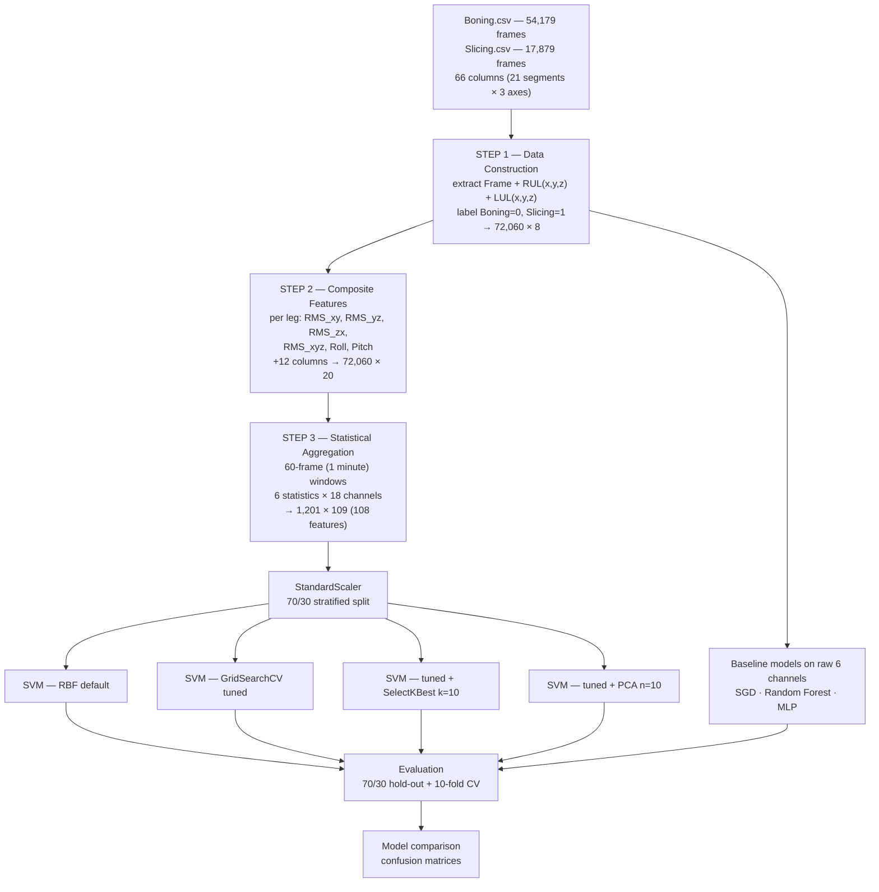

# Human Activity Recognition from Body-Worn Motion Sensors


Activity classification for meat-processing workers using full-body motion capture data. The project distinguishes two industrial tasks — boning and slicing — from lower-body accelerometer signals, through a four-stage feature engineering pipeline that transforms raw per-frame readings into windowed statistical descriptors.

## Project Description

Meat-processing work involves physically demanding, highly repetitive motions. Boning and slicing place different biomechanical loads on the body: boning requires forceful whole-body pushing with weight shifted through the legs for leverage, while slicing is a more controlled and repetitive motion with lighter lower-body involvement. Distinguishing these automatically from wearable sensor data enables workload monitoring and ergonomic risk assessment without manual observation.

The dataset comes from full-body motion capture — 21 body segments recorded across three axes each, at frame-level resolution. Following the assessment specification, six channels were selected: the x, y and z acceleration of the **Right Upper Leg** and **Left Upper Leg**.

The project is structured as a progressive pipeline where each stage produces a persisted dataset:

| Stage | Output | Shape |
| --- | --- | --- |
| Step 1 — Data construction | Combined labelled dataset | 72,060 × 8 |
| Step 2 — Composite features | Derived motion channels added | 72,060 × 20 |
| Step 3 — Statistical aggregation | Per-minute windowed features | 1,201 × 109 |
| Step 4–6 — Modelling | Seven model configurations benchmarked | — |

Seven configurations were evaluated under both a 70/30 hold-out split and 10-fold cross-validation: four SVM variants exploring hyperparameter tuning and dimensionality reduction, plus SGD, Random Forest and MLP classifiers trained on the raw six-channel data as a baseline.

Intended readers are machine learning practitioners working on sensor-based activity recognition, time-series feature engineering and industrial monitoring applications.

## What Problem Does It Solve?

**The real-world problem.** Repetitive-strain injury is a persistent occupational hazard in meat processing. Understanding which tasks a worker performs, and for how long, is a prerequisite for ergonomic intervention — but manual observation is labour-intensive, intrusive and cannot scale across a shift or a workforce.

**Existing limitations.**

- **Signal noise.** Frame-level acceleration readings are extremely noisy. Training directly on raw per-frame values gives poor separability, as the baseline models in this project demonstrate.
- **Limited channel access.** Only six of 66 available channels were used. A single-axis reading in isolation carries little information about the compound movement actually being performed.
- **Class imbalance.** Boning accounts for 75.2% of samples against 24.8% for slicing, so aggregate accuracy can look respectable while minority-class recall is poor.
- **Sample scarcity after aggregation.** Windowing 72,060 frames into per-minute segments yields only 1,201 samples — against 108 engineered features, an unfavourable ratio that risks overfitting.
- **Temporal structure.** An activity is defined by a pattern *over time*, not by any single instant. Frame-level classification discards the temporal information that distinguishes the two tasks.

**Why this was developed.** The project tests how much of the classification performance comes from the model versus from the feature representation — and the answer is unambiguous. The same class of problem, approached with raw frames versus engineered windowed features, differs by more than 11 percentage points.

**Benefits of the solution.**

- Statistical aggregation over 60-frame windows smooths sensor noise while capturing the temporal signature of each activity.
- Composite channels (RMS magnitudes, roll and pitch) encode compound movement that individual axes cannot express.
- A label-shuffling control experiment empirically verifies that the model learns genuine structure rather than exploiting class priors.
- Every configuration is validated twice — hold-out and 10-fold cross-validation — so no result rests on a single favourable split.
- Two dimensionality reduction approaches were tested and reported honestly, including the finding that both reduced performance.

## Tech Stack

| Category | Technologies |
| --- | --- |
| Programming Language | Python |
| Data Processing | pandas, NumPy |
| Signal Processing | SciPy (`find_peaks`, `trapz` for area under curve) |
| Machine Learning | scikit-learn — `SVC`, `SGDClassifier`, `RandomForestClassifier`, `MLPClassifier`, `DecisionTreeClassifier` |
| Feature Selection | `SelectKBest` with `f_classif` (ANOVA F-test) |
| Dimensionality Reduction | `PCA` |
| Model Selection | `GridSearchCV`, `cross_val_score`, `train_test_split` |
| Preprocessing | `StandardScaler` |
| Evaluation | classification report, confusion matrix, accuracy |
| Visualisation | Matplotlib, seaborn |
| Environment | Jupyter Notebook |
| Version Control | Git |

## Methodology

### Pipeline overview



### Step 1 — Data construction

Two source files were combined, retaining the frame index and six lower-body acceleration channels:

| Source | Frames | Class label |
| --- | --- | --- |
| `Boning.csv` | 54,180 | 0 |
| `Slicing.csv` | 17,880 | 1 |
| **Combined** | **72,060** | — |

**Channel selection rationale.** Boning demands forceful whole-body pushing motions with weight shifted through the legs for leverage; slicing is a more controlled, repetitive motion with smoother and lighter lower-body movement. The upper-leg segments therefore carry the biomechanical difference between the two tasks.

**Label validation.** Rather than assuming class labels carry information, a control experiment trained an identical Decision Tree twice — once on correct labels, once on randomly shuffled labels:

| Label condition | Accuracy |
| --- | --- |
| Correct labels | 0.6740 |
| Randomly shuffled labels | 0.6212 |

The gap confirms the model learns a genuine relationship between motion and activity. The shuffled-label model still reaches 62% because it can exploit the 75/25 class prior, which itself illustrates why accuracy alone is inadequate for imbalanced data.

### Step 2 — Composite feature engineering

Twelve derived channels were computed — six per leg — capturing compound motion that individual axes cannot express:

| Feature | Formula | Interpretation |
| --- | --- | --- |
| `RMS_xy` | √((x² + y²) / 2) | Magnitude in the horizontal plane |
| `RMS_yz` | √((y² + z²) / 2) | Magnitude in the sagittal plane |
| `RMS_zx` | √((z² + x²) / 2) | Magnitude in the frontal plane |
| `RMS_xyz` | √((x² + y² + z²) / 3) | Overall acceleration magnitude |
| `Roll` | orientation angle | Lateral tilt of the segment |
| `Pitch` | orientation angle | Forward/backward tilt of the segment |

Applied to both legs, this expands the feature set from 6 to 18 motion channels.

### Step 3 — Statistical aggregation

Frame-level data is too noisy to classify directly. Each activity was partitioned into non-overlapping 60-frame (one-minute) windows, and six statistics computed per channel:

| Statistic | Captures |
| --- | --- |
| Mean | Central tendency of the movement |
| Standard deviation | Movement variability |
| Minimum | Lower bound of range of motion |
| Maximum | Upper bound of range of motion |
| Area under curve | Cumulative signal magnitude over the window |
| Number of peaks | Movement repetition rate |

18 channels × 6 statistics = **108 features**. Windows are computed per activity independently so that no window spans a class boundary.

| Class | Windows |
| --- | --- |
| Boning (0) | 903 |
| Slicing (1) | 298 |
| **Total** | **1,201** |

The peak count is the statistic that most directly encodes the repetitive nature of slicing versus the forceful, less rhythmic motion of boning — and it dominates the subsequent feature selection.

### Step 4 — Model development

Features were standardised and split 70/30 with stratification (841 train, 361 test — 271 boning, 90 slicing).

**SVM hyperparameter search** via `GridSearchCV` over 10-fold CV:

```python
param_grid = {
    'C':      [0.1, 1, 10, 100],
    'gamma':  ['scale', 'auto', 0.01, 0.001],
    'kernel': ['rbf', 'linear', 'poly']
}
# Best: C=1, gamma=0.01, kernel='rbf'  (CV score 0.8881)
```

**Dimensionality reduction** was tested two ways:

- `SelectKBest(f_classif, k=10)` selected ten features, all of them peak counts: `Right Upper Leg x_peaks`, `Left Upper Leg x_peaks`, `RUL_RMS_xy_peaks`, `RUL_RMS_zx_peaks`, `RUL_RMS_xyz_peaks`, `RUL_Pitch_peaks`, `LUL_RMS_xy_peaks`, `LUL_RMS_zx_peaks`, `LUL_RMS_xyz_peaks`, `LUL_Pitch_peaks`.
- `PCA(n_components=10)` retained 71.50% of total variance, with the first component alone accounting for 35.09%.

**Baseline comparison.** SGD, Random Forest and MLP classifiers were trained on the *raw six-channel Step 1 data* (50,442 train / 21,618 test frames) to quantify what the feature engineering pipeline contributes.

## Result

### Model comparison

| Model | Feature set | Train-Test (70/30) | 10-Fold CV |
| --- | --- | --- | --- |
| **SVM (basic RBF)** | 108 engineered | **0.8809** | **0.8785** |
| SVM (tuned) | 108 engineered | 0.8781 | 0.8768 |
| SVM (tuned + 10 PCA) | 10 components | 0.8615 | 0.8718 |
| SVM (tuned + 10 best) | 10 selected | 0.8476 | 0.8401 |
| MLP | 6 raw channels | 0.7685 | 0.7633 |
| Random Forest | 6 raw channels | 0.7673 | 0.7651 |
| SGD | 6 raw channels | 0.3603 | 0.5475 |

10-fold CV scores for the best model ranged 0.825 to 0.933 with a standard deviation of 0.0296.

### Per-class performance — SVM (basic RBF)

| Class | Precision | Recall | F1 | Support |
| --- | --- | --- | --- | --- |
| Boning | 0.90 | 0.95 | 0.92 | 271 |
| Slicing | 0.82 | 0.67 | 0.74 | 90 |
| **Accuracy** | | | **0.88** | 361 |
| Macro average | 0.86 | 0.81 | 0.83 | |

The gap between boning recall (0.95) and slicing recall (0.67) reflects the 3:1 class imbalance — the minority activity is systematically harder to detect.

### Effect of feature engineering

| Approach | Best accuracy |
| --- | --- |
| Raw 6-channel frames (best of SGD / RF / MLP) | 0.7685 |
| Engineered 108-feature windows (SVM) | 0.8809 |
| **Improvement** | **+11.24 pts** |

This is the project's central result. The comparison is not perfectly matched — the raw-data models operate at frame level on 72,060 samples while the engineered models operate at window level on 1,201 — but the difference between per-frame and per-window classification is precisely the point being tested. Activity is defined by patterns over time, and no classifier can recover from a representation that discards them.

### Effect of dimensionality reduction

| Configuration | Features | Train-Test | 10-Fold CV | Change vs full |
| --- | --- | --- | --- | --- |
| Full feature set | 108 | 0.8809 | 0.8785 | — |
| PCA (10 components) | 10 | 0.8615 | 0.8718 | −1.94 / −0.67 pts |
| SelectKBest (10 features) | 10 | 0.8476 | 0.8401 | −3.33 / −3.84 pts |

Both approaches reduced accuracy. Three factors explain this:

- Cutting from 108 features to 10 discards roughly 91% of the feature set — a very aggressive reduction.
- PCA retained only 71.5% of variance, and because PCA is unsupervised, the discarded 28.5% may contain class-discriminative structure.
- `SelectKBest` selected exclusively peak-count features, losing the complementary information in mean, standard deviation, min, max and AUC that contributes when used jointly.

The RBF kernel is also relatively robust to high dimensionality, so the SVM was not suffering the dimensionality penalty that would motivate reduction in the first place.

### Model behaviour

The SGD classifier's collapse to 36.03% on the hold-out split — well below the 75% majority-class baseline — is the clearest evidence that the raw six-channel data is not linearly separable. With `class_weight='balanced'`, SGD's linear decision boundary produced 86% recall on slicing at the cost of only 20% recall on boning, inverting the class prior entirely. Random Forest and MLP, both capable of non-linear boundaries, reached roughly 77% on the same data.

Hyperparameter tuning yielded no improvement over the default RBF configuration (0.8781 versus 0.8809), indicating the default `gamma='scale'` heuristic was already near-optimal for this standardised feature space.

## Project Structure

```
.
├── Portfolio1_MuhammadAshrull_102782025.ipynb   Full pipeline — Steps 1 to 6
├── ampc2/
│   ├── Boning.csv                    Raw motion capture — boning (54,180 frames × 66 cols)
│   ├── Slicing.csv                   Raw motion capture — slicing (17,880 frames × 66 cols)
│   ├── Dataset_Combined_Step1.csv    Step 1 output — 72,060 × 8
│   ├── Dataset_Composite_Step2.csv   Step 2 output — 72,060 × 20
│   └── Dataset_Features_Step3.csv    Step 3 output — 1,201 × 109
├── Index/
│   └── Chat_Screenshot.docx          GenAI usage documentation
└── README.md
```

## Dataset Information

**Source data.** Full-body motion capture recordings of meat-processing tasks, containing 21 body segments (L5, L3, T12, T8, Neck, Head, shoulders, arms, forearms, hands, upper legs, lower legs, feet, toes) recorded across x, y and z axes — 66 columns including the frame index.

**Channels used.** Six of 66 — `Right Upper Leg x/y/z` and `Left Upper Leg x/y/z` — selected per the assessment specification.

| File | Rows | Columns | Description |
| --- | --- | --- | --- |
| `Boning.csv` | 54,180 | 66 | Raw capture, boning activity |
| `Slicing.csv` | 17,880 | 66 | Raw capture, slicing activity |
| `Dataset_Combined_Step1.csv` | 72,060 | 8 | Selected channels + class label |
| `Dataset_Composite_Step2.csv` | 72,060 | 20 | Plus 12 composite motion features |
| `Dataset_Features_Step3.csv` | 1,201 | 109 | Per-minute statistical features |

**Class distribution:** Boning 54,180 frames / 903 windows (75.2%), Slicing 17,880 frames / 298 windows (24.8%).

## Installation

```bash
git clone https://github.com/AshProg/COS40007-MeatProcessingActivityRecognition.git
cd COS40007-MeatProcessingActivityRecognition

pip install pandas numpy scipy scikit-learn matplotlib seaborn jupyter
```

## Usage

```bash
jupyter notebook Portfolio1_MuhammadAshrull_102782025.ipynb
```

The notebook executes top to bottom in six steps, each writing its intermediate dataset to `ampc2/`:

| Step | Contents |
| --- | --- |
| Step 1 | Data construction and label validation experiment |
| Step 2 | Composite feature engineering (RMS, roll, pitch) |
| Step 3 | Per-minute statistical aggregation |
| Step 4 | Model training — four SVM configurations plus three baselines |
| Step 5 | Model improvement experiments and comparison chart |
| Step 6 | Final evaluation, confusion matrices, model selection |

`GridSearchCV` in Step 4 searches 48 parameter combinations across 10 folds and is the slowest cell. All random states are fixed at 42; the intermediate CSVs are committed, so any step can be run independently of the ones before it.

## Conclusion

**Achievements.** The pipeline classifies two industrial activities from six accelerometer channels at 88.09% accuracy, validated at 87.85% under 10-fold cross-validation. The four-stage feature engineering process improved on raw-signal classification by 11.24 percentage points, and a label-shuffling control experiment verified the model learns genuine motion structure rather than class priors.

**Lessons learned.** The dominant lesson was that representation mattered more than model selection. Three different algorithm families all plateaued around 77% on raw frames, while a default-configuration SVM on engineered windows reached 88% — hyperparameter tuning then added nothing. The dimensionality reduction results were the most instructive negative finding: both PCA and univariate selection reduced accuracy, and `SelectKBest` choosing exclusively peak-count features showed how univariate ranking misses that features contribute jointly rather than independently. The SGD collapse to 36% was also useful, since it demonstrated concretely that balanced class weighting on non-separable data does not fix the problem, it just relocates the errors.

**Strengths.** Every stage persists its output, making the pipeline auditable and independently re-runnable. Dual validation via hold-out and cross-validation prevents over-reading a single split. Feature engineering is grounded in biomechanical reasoning rather than applied blindly. The label-shuffling control is a rigorous check that is often omitted. Negative results are reported rather than suppressed.

**Limitations.** The 3:1 class imbalance was not addressed — no resampling or class weighting was applied to the SVM — and slicing recall of 0.67 is the direct consequence. Aggregation reduces the dataset to 1,201 samples against 108 features, an unfavourable ratio. Non-overlapping windows discard boundary information that a sliding window would retain. Only six of 66 available channels were used, so upper-body movement is entirely unobserved. The engineered-versus-raw comparison differs in both representation and sample granularity, so it demonstrates the value of the pipeline as a whole rather than isolating a single cause. No temporal model such as an LSTM or 1D CNN was evaluated against the hand-engineered features.

**Future improvements.** Applying SMOTE or class weighting would directly target the slicing recall deficit, which is the model's clearest weakness. Overlapping windows would increase sample count and preserve transitions between activities. Incorporating upper-body channels — particularly forearm and hand segments, which plausibly differ more between boning and slicing than the legs do — would test whether the specified channel restriction is limiting. Benchmarking an LSTM or 1D CNN against the engineered features would establish whether learned temporal representations outperform hand-crafted statistics. Retaining more PCA components to reach 95% explained variance would test whether the reduction penalty is due to aggressiveness rather than the method itself.

---

This project demonstrates sensor-based activity recognition end to end — domain-informed feature engineering for time-series data, systematic model benchmarking with dual validation, and controlled experiments that isolate what actually drives performance.
